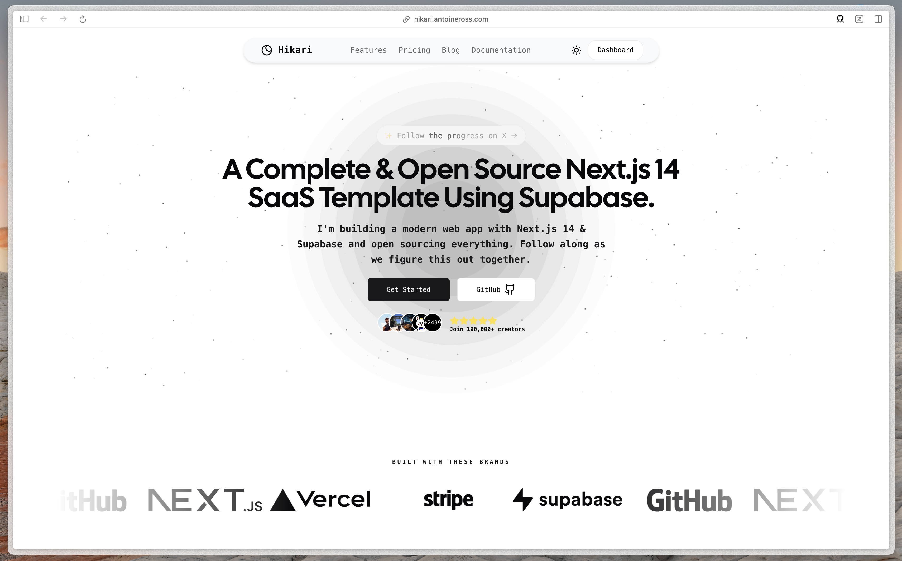
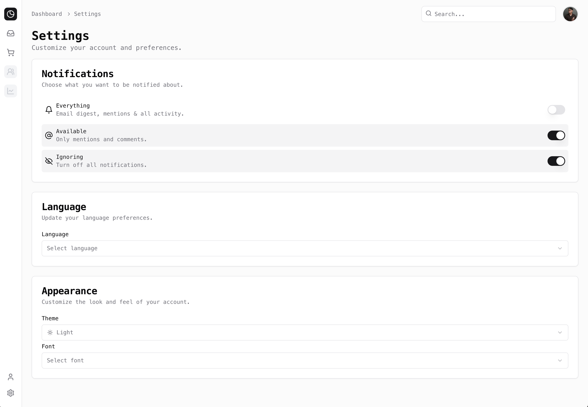

# 🚀 Hikari: Complete Next.js SaaS Starter

Hikari is a high-performance, all-in-one SaaS template built with **Next.js**, **TailwindCSS**, and **Supabase**. It provides everything you need to launch your next project quickly, from authentication to subscription management.

## ✨ Features

- 🔐 **Secure Authentication**: User management powered by [Supabase Auth](https://supabase.io/docs/guides/auth).
- 🛠️ **Data Management**: Advanced PostgreSQL handling via [Supabase Database](https://supabase.io/docs/guides/database).
- 💳 **Stripe Integration**: Ready-to-use [Stripe Checkout](https://stripe.com/docs/payments/checkout) and [Customer Portal](https://stripe.com/docs/billing/subscriptions/customer-portal).
- 🌐 **Dynamic Pricing**: Real-time sync of plans and subscriptions using [Stripe Webhooks](https://stripe.com/docs/webhooks).
- ⚛️ **Modern Stack**: Built with **React 18**, **TypeScript**, and **tRPC** for a type-safe developer experience.
- 🎨 **Premium UI**: Beautiful, accessible components from **Shadcn/ui** and **Tailwind UI**.
- 🔍 **Safety First**: Robust validation with **Zod**.
- 📈 **SEO & Performance**: Optimized for speed, accessibility, and search engine visibility.

## 🎬 Demonstration

### Landing Page

### User Dashboard

### Subscription Management

---

## 📄 Quick Start

1. **Clone the repository**
2. **Install dependencies**: `pnpm install`
3. **Set up Environment Variables**: Copy `.env.example` to `.env.local`.
4. **Run development server**: `pnpm dev`

---

## 🤝 Contribution

We welcome community contributions! Please feel free to fork the repo and submit a pull request.

## ❤️ Support

If you find this project helpful, please give it a 🌟 on GitHub!

---

**Developed by [Daniel Lopez](mailto:rouviourgermanmeetings@gmail.com)**
Follow on GitHub: [daniellopez882](https://github.com/daniellopez882)

---

## Author & Contact

- **GitHub:** [@rouviour-german](https://github.com/rouviour-german)
- **Email:** [rouviourgermanmeetings@gmail.com](mailto:rouviourgermanmeetings@gmail.com)
- **Profile:** https://github.com/rouviour-german

